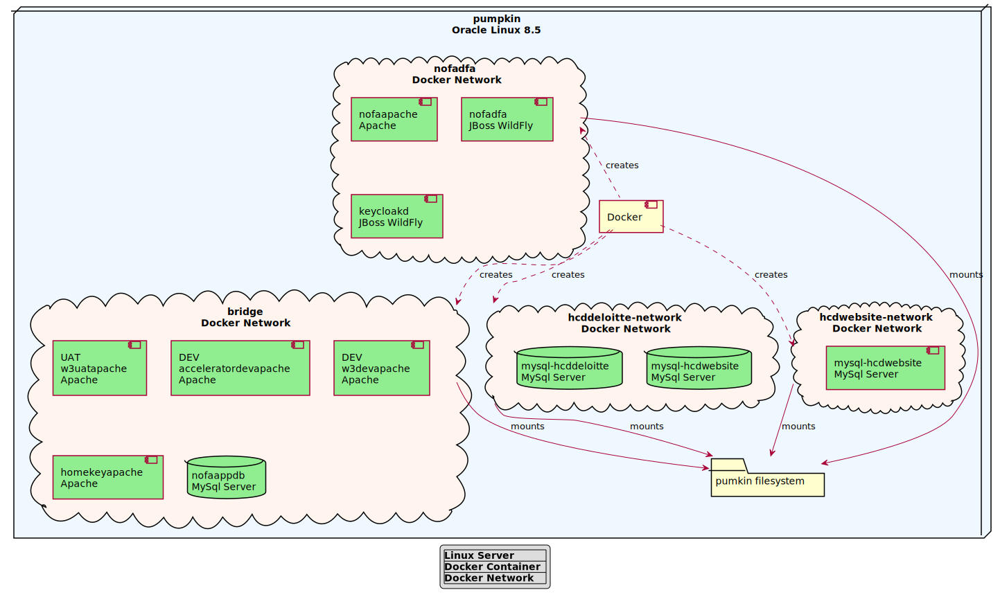
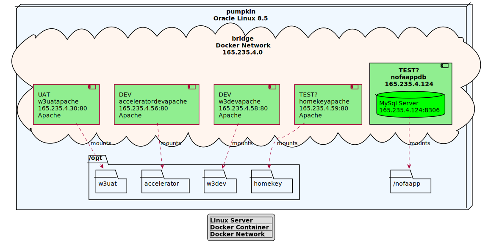
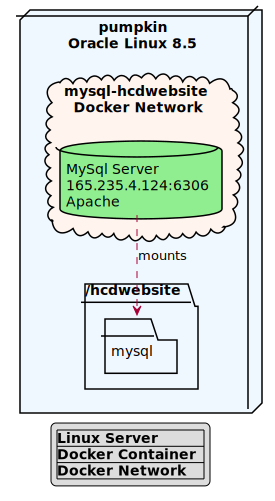
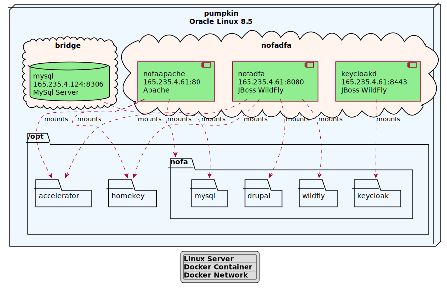

= HCD Web/Drupal Setup Notes
For Internal Use Only

image::images/HCD_head_web.png[align="center"]

:revnumber: 11/29/2021
:Author Initials: pxp
:email: <piotr.palacz@hcd.ca.gov>
:icons:
:numiered:
:toc:

ifdef::backend-html5[]
:twoinches: width='144'
:full-width: width='100%'
:half-width: width='50%'
:half-size: width='50%'
:thumbnail: width='60'
:size10: width='10%'
:size15: width='15%'
:size25: width='25%'
:size40: width='40%'
:size50: width='50%'
:size60: width='60%'
:size75: width='75%'
endif::[]
ifdef::backend-pdf[]
:twoinches: pdfwidth='2in'
:full-width: pdfwidth='100vw'
:half-width: pdfwidth='50vw'
:half-size: pdfwidth='50%'
:thumbnail: pdfwidth='20mm'
:size10: pdfwidth='10%'
:size15: pdfwidth='15%'
:size25: pdfwidth='25%'
:size40: pdfwidth='40%'
:size50: pdfwidth='50%'
:size60: pdfwidth='60%'
:size75: pdfwidth='75%'
endif::[]
ifdef::backend-docbook5[]
:twoinches: width='50mm'
:full-width: scaledwidth='100%'
:half-width: scaledwidth='50%'
:half-size: width='50%'
:thumbnail: width='20mm'
:size40: width='40%'
:size50: width='50%'
endif::[]

== Overview

This document provides an overview of deployment of web-related servers, containers, and servers at HCD.

The configuration and deployment information presented is based on the following:

* Docker runtime metadata for the docker containers active at the time of writing

* Configuration files (e.g., for Apache httpd, MySql server)

* Various shell/cli scripts

WARNING: Given the type of information provided, it is _not_ a public document, and its internal circulation should be limited to people with direct or oversight responsibility for the areas described.
 
=== Main Sections

. The section <<DEV and TEST for Web>> describes how DEV and TEST environments for Web-related applications are organized at HCD.

 
 

=== Change History

.Change History
[width="98%",cols="3,^5,10",options="header"]
|=========================================================
|Date | Contact |Description 

|12/06/2021 |   piotr.palacz@hcd.ca.gov | Diagrams added.

|11/24/2021 |   piotr.palacz@hcd.ca.gov | Document created  

|=========================================================

== Context

== DEV and TEST Environments for Web-related Apps

=== Docker DEV and TEST Overview

// image::images/MID02-naming.png[Naming MID Server,width=50%,align="center"

=== Docker Networks on Pumpkin

==== Bridge Network

==== Deloitte Network

image::plantuml/pumpkinNetDeloitte.svg[Deloitte Network on pumpkin,{size60},align="center"]

==== HCD Network

==== Nofadfa Network

<end>
