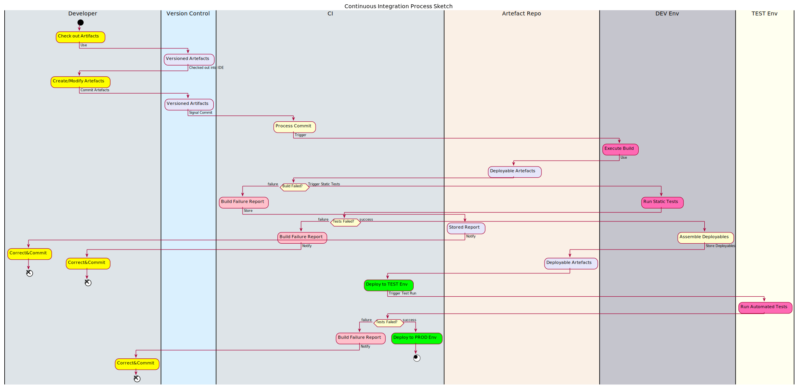
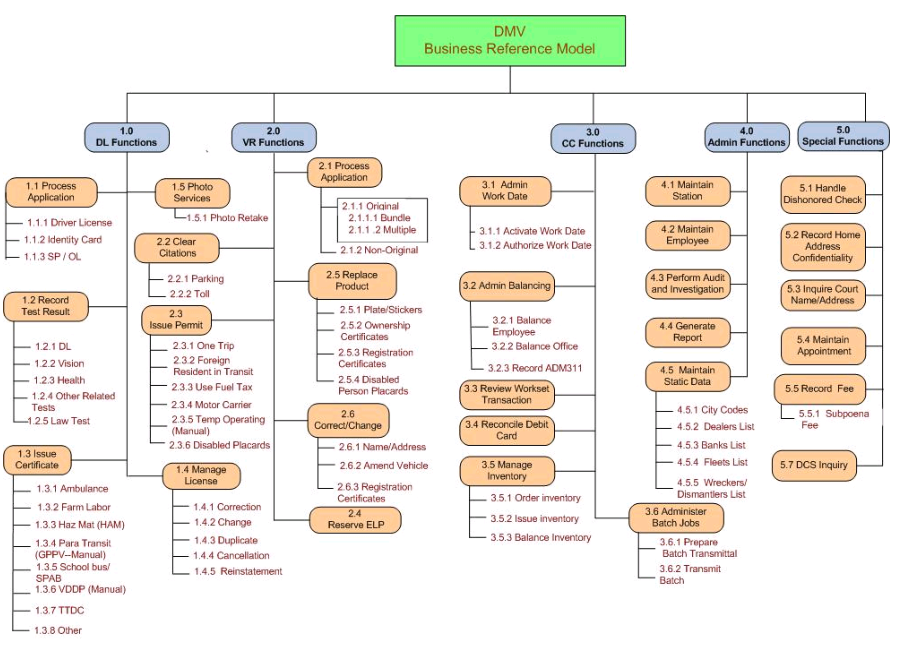
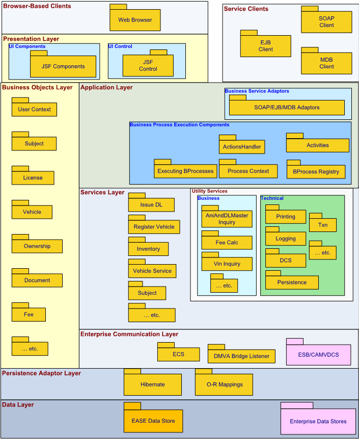
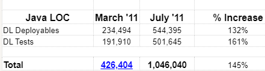

= Tales of Continuous Integration
(or: Lessons Learnt when Adopting CI)

image::images/HCD_head_web.png[align="center"]

:revnumber: 12/01/2021
:Author Initials: pxp
:email: <piotr.palacz@hcd.ca.gov>
:icons:
:numbered:
:toc:

ifdef::backend-html5[]
:twoinches: width='144'
:full-width: width='100%'
:half-width: width='50%'
:half-size: width='50%'
:thumbnail: width='60'
:size10: width='10%'
:size15: width='15%'
:size25: width='25%'
:size40: width='40%'
:size50: width='50%'
:size60: width='60%'
:size75: width='75%'
:size90: width='90%'
endif::[]
ifdef::backend-pdf[]
:twoinches: pdfwidth='2in'
:full-width: pdfwidth='100vw'
:half-width: pdfwidth='50vw'
:half-size: pdfwidth='50%'
:thumbnail: pdfwidth='20mm'
:size10: pdfwidth='10%'
:size15: pdfwidth='15%'
:size25: pdfwidth='25%'
:size40: pdfwidth='40%'
:size50: pdfwidth='50%'
:size60: pdfwidth='60%'
:size75: pdfwidth='75%'
:size90: pdfwidth='90%'
endif::[]
ifdef::backend-docbook[]
:twoinches: width='50mm'
:full-width: scaledwidth='100%'
:half-width: scaledwidth='50%'
:half-size: width='50%'
:thumbnail: width='20mm'
:size40: width='40%'
:size50: width='50%'
endif::[]

ifdef::backend-revealjs[]
:twoinches: width='144'
:full-width: width='100%'
:half-width: width='50%'
:half-size: width='50%'
:thumbnail: width='60'
:size10: width='10%'
:size15: width='15%'
:size25: width='25%'
:size40: width='40%'
:size50: width='50%'
:size60: width='60%'
:size75: width='75%'
endif::[]

== Introduction

This presentation is based on real-life, first-hand experiences when adopting CI in sizeable state projects. Most of it covers the years 2008-2012 and a single project, with some additions outside that period.

NOTE: This document is intended for internal circulation as a discussion material for the CI/CD-related efforts within HCD.

=== DevOps vs. CI

DevOps is usually described along the following lines:

"DevOps is a set of practices that combines software development (Dev) and IT operations (Ops). 
It aims to shorten the systems development life cycle and provide continuous delivery with high software quality. - Wikipedia"

The focus here is more on the Dev part of DevOps, partially for historical reasons - as a decade ago the Ops part was rarely - if at all - integrated with the Dev workflow. For the sake of this discussion, the term CI is taken to mean the "Dev" part of DevOps, even though it is often understood more narrowly, as a specific discipline regarding development, e.g., as in the following:

" In software engineering, continuous integration (CI) is the practice of merging all developers' working copies to a shared mainline several times a day. - Wikipedia"

===  Outline

. CI Key Ideas and Building Blocks
. Sample Case: the EASE Project
.. Project Context
.. CI-related choices 
.. Implemented CI capabilities
.. Underdeveloped areas
. Lessons for:
.. the Developer, 
.. the Tester, 
.. the Technical Manager
. A Decade+ Later
 
== CI Key Ideas 

Software construction (or "development") is like any other "functional" process:

* Has different roles to it

* Has various activities in it

* Some of them are not (yet) automatable, but many may be

* Regardless, they form a workflow or series of related workflows

If "development" is treated as a _business process_ (and in some way, it is), how would we approach it?

== Some of the Pain Points

* Keeping track of: 

** Coding and config artifacts versions 

** Inter-Component dependencies and resulting complex build actions

* Testing in various forms

** Esp. if manual

** Regardless, need to measure and report

* Assembling and storing deployable artifacts and installing them in the target environment

* Reacting to specific events (most types of changes when committed) and triggering applicable actions 

* Keeping track of the relevant, local know-how

* Keeping track of requests, defects, and their state

* Maintaining traceability from tests/code back to requirements

== CI Building Blocks

* *Version Control System* (cvs, subversion, git, etc.): keeping track of versions and their sets

* *Build System* (make, maven, gradle, etc.): taking care of complex builds and their outcomes

* *Wiki* (MediaWiki, JAMWiki, JIRA Confluence, etc.): keeping track of know-how by the team

* *Issue/Bug Tracking* (JIRA, Backlog, Redmine, etc. )

* *CI System* (Hudson/Jenkings, TeamCity, Bamboo, etc.): Processing change/commit events in a predefined workflow and triggering actions in response to relevant events

NOTE: The building blocks above are configurable/extensible, using various plugins.

Most often used plugins cover the following:

* Running tests and reporting their results

* Generating API/source code documentation

* Sending/receiving notifications/emails

* Statically analyzing the source code as per standards and project guidelines

* Moving deployment artifacts among servers, environments

* etc.

WARNING: Visio, Excel, MS Project, and similar, are rarely useful as CI tooling.

== The Case of the EASE Project

=== EASE Cultural and Technological Starting Points

* Traditional, mainframe and System/2-based development culture
* Challenges in understanding the needs of large software construction project (the _Restaurant Metaphor_) 
* Fear of change and of technological _novelties_, micromanaged

However, it was a clean slate for: 

* Mainstream SOA 

* Incremental/rapid SDLC

* J2EE-based software construction

=== System Overview

(PDF on-line)

* Business Reference Model

* Component Model

* Sample Code Metrics

Sample metrics from a single major component ("DL"), servicing Driver Licenses.

== EASE CI Implementation

=== EASE CI Challenges

. To figure out the CI process and capabilities to support

. To choose tools/components for the process, not the other way around

. To sensibly configure the components

. To tie all the pieces together

. To convince people to adopt and actually use the new way of doing things.

=== EASE CI Basic Setup

image::images/EASE-CI-simple.png[Basic CI Setup,{size60}, align="center"]

=== EASE CI Process Overview

* The developer modifying the code is responsible for: 

** Keeping all activity version-controlled

** Creating/adjusting the corresponding test(s) for the artifact being worked on

** Resolving failures identified during build, static analysis, automated testing

** Tracing the code and tests back to requirements

* CI is responsible for:

** Orchestrating interactions between CI components

** Scheduling/triggering the builds and tests

** Processing failures (reports, blame, notifications)

** Promoting deployable artifacts on success, among the environments

** Producing, storing, and serving reports, technical documentation, etc.

=== EASE CI Capabilities

. IDEs configured with VCS (standard today)

. Automated builds triggered by schedule and commit events

. Automated generation of the following:

.. Source code (including Unit Test) documentation 

.. Build and dependency reports

.. More (DEMO)

. Static code analysis

. Automated Unit Test execution, including:

.. Coverage determination

.. Reporting of outcomes

.. Determining whom to notify and notification of failures by email

. Wiki-based document repository, including:

.. Architectural documents and guidelines

.. Standards and Guidelines

.. HOWTOs, code samples, tutorials, cookbooks

=== EASE CI Building Blocks 

* *Version Control System*:  CVS https://en.wikipedia.org/wiki/Concurrent_Versions_System

* *Build System* and *Artifact Repo*: maven https://maven.apache.org

* *CI System*: Jenkins https://en.wikipedia.org/wiki/Jenkins_(software)

* *Wiki*: JAMWiki (clone of MediaWiki as in https://wikipedia.org)

* *IDE*: IBM Rational/Eclipse https://www.eclipse.org/

NOTE: There were no multiple or dedicated administrators for ##1-6 (with exception of Unit Test creation); all maintenance done on fractional time basis. All software components were Open Source, with exception of the commercial version of Eclipse (RSA IDE)

==  Lessons Learnt

=== For the Developer 

* Unit Testing turns out to be my friend rather than an enemy, despite the initial misgivings

** It makes clear what the _unit_ is expected to do

** It makes refactoring feasible, even aggressive refactoring when needed

* Granular and frequent commits in CI decrease version conflicts among committers and my stress in general

** I know where we are, at least at top of the hour

** However, I cannot hoard my code for a long time 

* I am not subject to the blame game: assignment of defect is objective and mechanized

===  For the Tester

* The system I am to test has no trivial _repeated_ failures

* Regression testing at the basic level is already taken care of for me

* Low-level tests are repeatable, with known success rate and coverage, and I can rely on that

* Configuration/assembly problems are rare:

** Everything is built multiple times a day

** The same configuration and built procedures are reused again and again - mechanically

* It makes sense for me to automate functional tests and integrate them into the overall CI workflow 

=== For the Technical Manager

* The scope of CI/CD can be incrementally grown, but there is a minimal level that must be reached

** Having all the required pieces in place (i.e., VCS, Build System, CI, e-mailing, Reporting/Documentation generation) 

** And properly configured to work together

** None of it is a _big_ effort to implement - single person-weeks are enough to get operational

* Acceptance of CI and related practices doesn't happen suddenly or by spontaneous acclamation

** This requires perseverance, esp. in conservative IT cultures

* CI is a type of technology that has visible impact on (dis)solving standard problems, such as:

** Sharing (rather than hoarding) the know-how

** Attribution of responsibility (e.g., code/test ownership)

** Maintaining good cadence of work (through small and frequent commits, builds)

== A Decade+ Later 

. CI in EASE did not include CD

.. CD not yet a mainstream concept at the time

.. Limited access to the target PROD environment (J2EE servers on mainframes [sic!]) managed by a separate department

. What Has Changed Since? 

.. Prominence of the Cloud-based solutions and Cloud-first approach

.. Virtual Machines, Containers (e.g., Docker) entered the mainstream practices

.. Expansion of CI to include CD (Continuous Delivery) --> DevOps

.. Natural evolution of tooling (e.g., IDEs, libraries, etc.)

The need for CI hasn't diminished:

* Adopting the Cloud or Cloud-based solutions doesn't remove the need for CI

* VMs, containers simplify CI, Testing, Deployment/Delivery

Surprisingly, some of the original EASE tooling choices are still valid.

== Next Steps

In context of HCD, we may want to consider the following:

* The CI/CD capabilities we want and the applicable workflow

* Tooling choices (past and future) and respective evaluation criteria

* Adoption approach and first steps

[appendix]
== Change History & Notes

NOTE: This document has been created using a _markup_: for the structure and the text (in this case, AsciiDoc) and for the diagrams (in this case, PlantUML). Consequently, HTML, PDF, and other format renditions of the document are generated from the markup source. Please contact the author(s) for the source.

.Change History
[width="95%",cols="3,^2,10",options="header"]
|=========================================================
|Date | Contact |Description 

|12/01/2021 |   piotr.palacz@hcd.ca.gov | Added EASE-specific diagrams
|11/30/2021 |   piotr.palacz@hcd.ca.gov | Added workflow diagram
|11/21/2021 |   piotr.palacz@hcd.ca.gov | Structure defined
|11/20/2021 |   piotr.palacz@hcd.ca.gov | Document started  

|=========================================================

<end>

